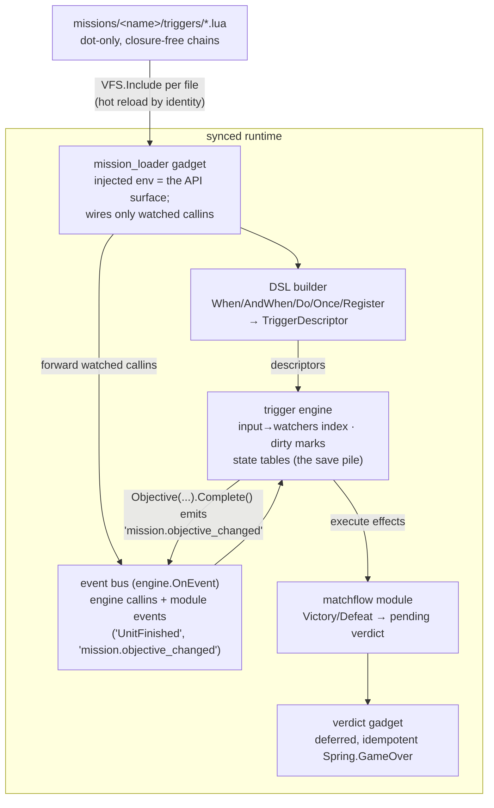

# The missions module

Mission logic is authored as dot-only, closure-free trigger chains in
missions/<name>/triggers/*.lua. The loader includes each file in an injected
environment (the env IS the API surface), the DSL builds descriptors, and the
trigger engine evaluates them — event-driven where conditions declare inputs,
polling as the fallback. Effects are lazy objects executed when a condition
fires; matchflow owns the game-over verdict.

