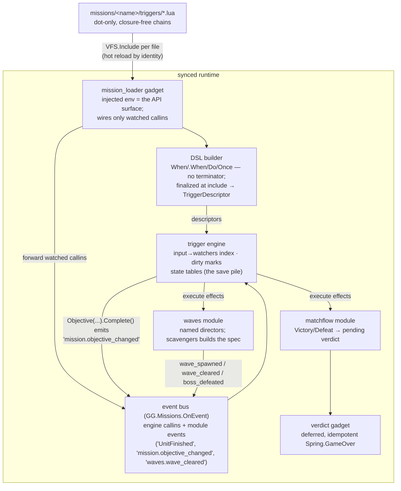

# The missions module

Mission logic is authored as dot-only, closure-free, terminator-free trigger chains in
missions/<name>/triggers/*.lua. The loader includes each file in an injected
environment (the env IS the API surface), the DSL builds descriptors, and the
trigger engine evaluates them — event-driven where conditions declare inputs,
polling as the fallback. Effects are lazy objects executed when a condition
fires; matchflow owns the game-over verdict.

```mermaid
flowchart TB
    LUA["missions/&lt;name&gt;/triggers/*.lua<br/>dot-only, closure-free chains"]
    subgraph SYNCED["synced runtime"]
        LOADER["mission_loader gadget<br/>injected env = the API surface;<br/>wires only watched callins"]
        DSL["DSL builder<br/>When/.When/Do/Once — no terminator;<br/>finalized at include → TriggerDescriptor"]
        ENGINE["trigger engine<br/>input→watchers index · dirty marks<br/>state tables (the save pile)"]
        BUS["event bus (GG.Missions.OnEvent)<br/>engine callins + module events<br/>('UnitFinished', 'mission.objective_changed', 'waves.wave_cleared')"]
        MF["matchflow module<br/>Victory/Defeat → pending verdict"]
        VG["verdict gadget<br/>deferred, idempotent Spring.GameOver"]
        WV["waves module<br/>named directors; scavengers builds the spec"]
    end
    LUA -->|"VFS.Include per file<br/>(hot reload by identity)"| LOADER
    LOADER --> DSL -->|"descriptors"| ENGINE
    LOADER -->|"forward watched callins"| BUS --> ENGINE
    ENGINE -->|"execute effects"| MF
    ENGINE -->|"execute effects"| WV
    ENGINE -->|"Objective(...).Complete() emits<br/>'mission.objective_changed'"| BUS
    WV -->|"wave_spawned / wave_cleared / boss_defeated"| BUS
    MF --> VG
```

The manifest's `requires` list is the whitelist of what a trigger file may
say: each required module ships a `mission_dsl.lua` whose env is merged into
the sandbox. `waves` contributes the verbs (`Waves.Begin/Intensify/Surge/End`
and the wave conditions); `scavengers` contributes the packs those verbs take
(`Scavengers.Skirmish/Assault/Horde`). A mission's scavengers need no bot —
but they do need the scavenger unit defs, which a game only derives when asked
(`forceallunits`, `ruins`, or a scavengers AI on the field).

Names have definition sites: `units.lua` declares every `Unit(...)` name the
triggers may reference, and `objectives.lua` every `Objective(...)` id — in
both cases a typo is a load error, not a silently-never-true condition. An
objective declaration carries its wording (`.Title`), its completion
(`.CompletedWhen`, `.When` to AND), and the tracker's cadence: declaration
order is the display order, the first line is revealed at arm and each next
when its predecessor completes (`.RevealedWhen` overrides, `.Foreshadow`
draws a line greyed-out early). The declarations compile into ordinary
triggers through the same DSL; the loader publishes the board to rulesparams
(`objective_display_order`, `objective_title_*`, `objective_revealed_*`),
and the `mission_objectives` widget just draws what the params say.
