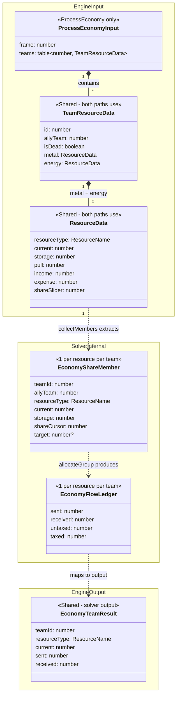
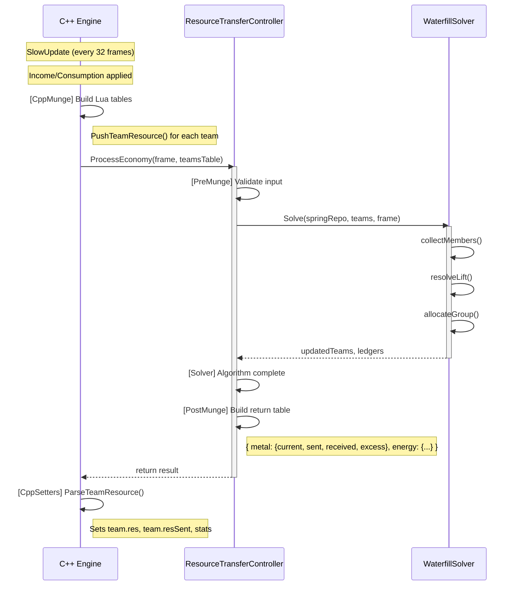
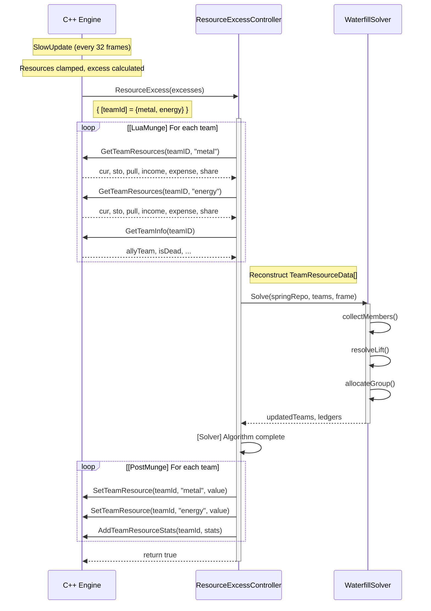

Ah, you are completely right. I was mistaking #2642 for #2530. My apologies! That does clear up a lot of the confusion.

# Economy Architecture: Path Comparison

This document compares the two economy resolution approaches and their data flow.

---

## Type Hierarchy (Engine-Centric View)



### Path Annotations

| Type | ProcessEconomy | ResourceExcess |
|------|----------------|----------------|
| `ProcessEconomyInput` | ✓ Engine provides | ✗ N/A |
| `TeamResourceData` | ✓ From engine | ✓ Lua reconstructs via GetTeamResources |
| `ResourceData` | ✓ From engine | ✓ Lua reconstructs |
| `EconomyShareMember` | ✓ Solver internal | ✓ Solver internal |
| `EconomyFlowLedger` | ✓ Solver internal | ✓ Solver internal |
| `EconomyTeamResult` | ✓ Returned to engine | ✓ Used to call setters |

### Data Flow

```
                          ┌─────────────────────────────────────┐
                          │           C++ ENGINE                │
                          │                                     │
                          │  team.res ──► PushTeamResource()    │
                          │                     │               │
                          │                     ▼               │
                          │         ProcessEconomyInput         │
                          │    { frame, teams: TeamResourceData[] }
                          └──────────────┬──────────────────────┘
                                         │
            ┌────────────────────────────┼────────────────────────────┐
            │                            ▼                            │
            │                    LUA CONTROLLER                       │
            │                            │                            │
            │                            ▼                            │
            │  ┌─────────────────────────────────────────────────┐    │
            │  │              WATERFILL SOLVER                   │    │
            │  │                                                 │    │
            │  │  TeamResourceData ──► EconomyShareMember[]      │    │
            │  │         │                    │                  │    │
            │  │         ▼                    ▼                  │    │
            │  │   (group by ally)    resolveLift + allocate     │    │
            │  │                              │                  │    │
            │  │                              ▼                  │    │
            │  │                    EconomyFlowLedger per team   │    │
            │  └─────────────────────────────────────────────────┘    │
            │                            │                            │
            │                            ▼                            │
            │                  EconomyTeamResult[]                    │
            │       [ {teamId, resourceType, current, sent, received} ]
            └────────────────────────────┬────────────────────────────┘
                                         │
                          ┌──────────────┴──────────────────────┐
                          │           C++ ENGINE                │
                          │                                     │
                          │  for each result in array:          │
                          │        │                            │
                          │        ▼                            │
                          │  team.res[resourceType] = current   │
                          │  team.stats[resourceType].sent += sent
                          │  team.stats[resourceType].recv += received
                          └─────────────────────────────────────┘
```

### Type Ownership

| Type | Defined In | Role |
|------|------------|------|
| `ResourceData` | types/spring.lua | Engine → Lua input (per-resource state) |
| `TeamResourceData` | types/spring.lua | Engine → Lua input (per-team container) |
| `EconomyTeamResult` | types/spring.lua | Lua → Engine output (flat array element) |
| `EconomyShareMember` | types/team_transfer.lua | Solver-internal per-resource view |
| `EconomyFlowLedger` | types/team_transfer.lua | Solver-internal flow tracking |

---

## Path A: ProcessEconomy Flow (V2 Handshake)

The Engine provides an atomic snapshot and accepts an atomic result. ResourceData[] is materialized **by the engine** and passed to Lua.



### Key Characteristics

| Aspect | Details |
|--------|---------|
| **Data Source** | Engine builds TeamResourceData[] via `PushTeamResource` |
| **Boundary Crossings** | 2 total (call + return) |
| **Return Contract** | `EconomyTeamResult[]` - flat array |
| **Stats Tracking** | Engine iterates array, applies current + stats |

### Return Type

```lua
---@class EconomyTeamResult
---@field teamId number
---@field resourceType ResourceName
---@field current number
---@field sent number
---@field received number

-- ProcessEconomy returns: EconomyTeamResult[]
-- One entry per team per resource (2 entries per team)
```

---

## Path B: ResourceExcess Flow (Patchwork)

The Engine notifies Lua of excess; Lua must **reconstruct** ResourceData[] by querying the engine.



### Key Characteristics

| Aspect | Details |
|--------|---------|
| **Data Source** | Lua reconstructs via `GetTeamResources` calls |
| **Boundary Crossings** | O(10N) - queries + setters |
| **Return Contract** | Just `true` (handled) |
| **Stats Tracking** | Lua calls `AddTeamResourceStats` |

---

## Timing Tag Alignment

### Raw Tags (Mutually Exclusive)

```
ProcessEconomy (Path A)
┌─────────────┬───────────┬─────────────┬───────────────┬──────────────┐
│PE_CppMunge  │ PE_Solver │PE_PostMunge │PE_PolicyCache │PE_CppSetters │
│  (Engine)   │  (Lua)    │  (Lua)      │    (Lua)      │  (Engine)    │
└─────────────┴───────────┴─────────────┴───────────────┴──────────────┘

ResourceExcess (Path B)
┌─────────────┬─────────────┬───────────┬─────────────┬───────────────┬──────────────┐
│RE_CppMunge  │ RE_LuaMunge │ RE_Solver │RE_PostMunge │RE_PolicyCache │RE_CppSetters │
│  (Engine)   │   (Lua)     │  (Lua)    │   (Lua)     │    (Lua)      │  (Engine)    │
└─────────────┴─────────────┴───────────┴─────────────┴───────────────┴──────────────┘
```

### Category Mapping (for Analysis)

| Category | Path A Tags | Path B Tags | Purpose |
|----------|-------------|-------------|---------|
| **DataPrep** | `PE_CppMunge` | `RE_CppMunge`, `RE_LuaMunge` | Time to prepare solver input |
| **Solver** | `PE_Solver` | `RE_Solver` | Waterfill algorithm |
| **ResultApply** | `PE_PostMunge`, `PE_CppSetters` | `RE_PostMunge`, `RE_CppSetters` | Time to apply results |
| **PolicyCache** | `PE_PolicyCache` | `RE_PolicyCache` | Policy cache update |

```python
# Analysis mapping (parser.py / notebooks)
TIMING_CATEGORIES = {
    'DataPrep': ['PE_CppMunge', 'RE_CppMunge', 'RE_LuaMunge'],
    'Solver': ['PE_Solver', 'RE_Solver'],
    'ResultApply': ['PE_PostMunge', 'PE_CppSetters', 'RE_PostMunge', 'RE_CppSetters'],
    'PolicyCache': ['PE_PolicyCache', 'RE_PolicyCache'],
    'Overall': ['PE_Overall', 'RE_Overall'],  # Aggregate timing
}

# Note: RE_CppMunge, RE_CppSetters, RE_Overall require engine instrumentation
# Currently engine only logs PE_* C++ phases
```

### Expected Profile

- **Path A**: More time in `PE_CppMunge` + `PE_CppSetters` (engine marshaling, atomic)
- **Path B**: More time in `RE_LuaMunge` + `RE_CppSetters` (Lua queries + N setter calls)
- **Solver**: Roughly equivalent (same algorithm)
- **Key comparison**: `PE_CppMunge` (one table build) vs `RE_CppMunge` + `RE_LuaMunge` (excess table + N queries)

---

## Data Flow Summary

### Path A: Engine → Lua → Engine (Atomic)

```
Engine                          Lua                              Engine
──────                          ───                              ──────
team.res         ─┐
team.resStorage  ─┼─→ PushTeamResource() ─→ TeamResourceData[]
team.resPull     ─┤                              │
team.resShare    ─┘                              ↓
                                         WaterfillSolver.Solve()
                                                 │
                                                 ↓
                                         EconomyTeamResult[]
                                         { teamId, resourceType, current, sent, received }
                                                 │
                    for each result ←────────────┘
                           │
                           ↓
                    team.res[resourceType] = current
                    team.stats[resourceType].sent += sent
                    team.stats[resourceType].received += received
```

### Path B: Engine → Lua (query) → Lua (apply)

```
Engine                     Lua                           Engine
──────                     ───                           ──────
excesses ──────────→ GetTeamResources() ×N  ←──────────→ returns data
                           │
                           ↓
                    TeamResourceData[]
                           │
                           ↓
                    WaterfillSolver.Solve()
                           │
                           ↓
                    EconomyTeamResult[]
                    { teamId, resourceType, current, sent, received }
                           │
                           ↓ (same data, different delivery)
                    for each result:
                      SetTeamResource()     ──────────→ sets team.res = current
                      AddTeamResourceStats()──────────→ sets stats (sent, received)
```

---

## Comparison

| Criterion | Path A (ProcessEconomy) | Path B (ResourceExcess) |
|-----------|-------------------------|-------------------------|
| **Philosophy** | Synchronous handshake | Many-method API |
| **Atomicity** | Single snapshot/result | Multiple queries |
| **Boundary Crossings** | O(1) | O(N) |
| **Data Source** | Engine provides | Lua reconstructs |
| **Return Contract** | `EconomyTeamResult[]` | `true` (handled) |
| **Stats Delivery** | Engine parses from return | Lua calls `AddTeamResourceStats` |
| **Blocking** | Engine waits for Lua | Event-driven |

### Design Trade-offs

**Path A (Synchronous)**: Engine blocks until Lua returns. Simpler mental model, no drift between solver and engine state. If Lua is slow, frame is slow.

**Path B (Event-driven)**: Engine fires event, Lua queries/applies via setters. More boundary crossings but Lua controls timing. Engine doesn't wait for Lua.

### On Blocking

ProcessEconomy blocking is **intentional and appropriate**:
- Economy resolution is on the critical path
- Game state depends on accurate resource values
- Async would add complexity without benefit (nothing else can proceed without resolved economy)
- If Lua is slow, optimize the solver, don't add async complexity
